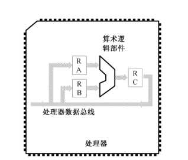

# 处理器、内存和指令

## 最早的处理器

1947 年发明了晶体管

1958 年发明了集成电路

1971 年Intel在位日本人设计计算器芯片的过程受到启发，生产了世界上第一个处理器 4004.

今天，我们已经知道，处理器（Processor）是一台电子计算机的核心，它会在振荡器脉冲的激励下，从内存中获取指令，并发起一系列由该指令所定义的操作。当这些操作结束后，它接着再取下一条指令。通常情况下，这个过程是连续不断、循环往复的。

## 寄存器与算术逻辑部件

计算机所有功能都是以数学计算为基础的。

处理器进行数学运算的简单原理

一旦被加数通过引脚送入处理器，代表这个二进制数字的一组电信号就会出现在与引脚相连的内部线路上。这是一排高低电平的组合，代表着二进制数中的每一位。这时候，必须用一个称为寄存器（Register）的电路锁住。之所以要这样做，是因为相同的引脚和线路马上还要用于输入加数。也正是因为这个原因，这些内部线路称为处理器内部总线。

同样地，加数也要锁进另一个寄存器中。如图所示，寄存器 RA 和 RB 将分别锁存参与运算的被加数和加数。此后，RA 和 RB 中的内容不再受外部数据线的影响。

寄存器是双向器件，可以在一端接受输入并加以锁存，同时，它也会在另一端产生一模一样的输出。与寄存器 RA 和 RB 相连的，是算术逻辑单元，或者算术逻辑部件（Arithmetic Logic Unit，ALU），也就是图中的桶形部分。它是专门负责运算的电路，可以计算加法、减法或者乘法，也可做逻辑运算。

