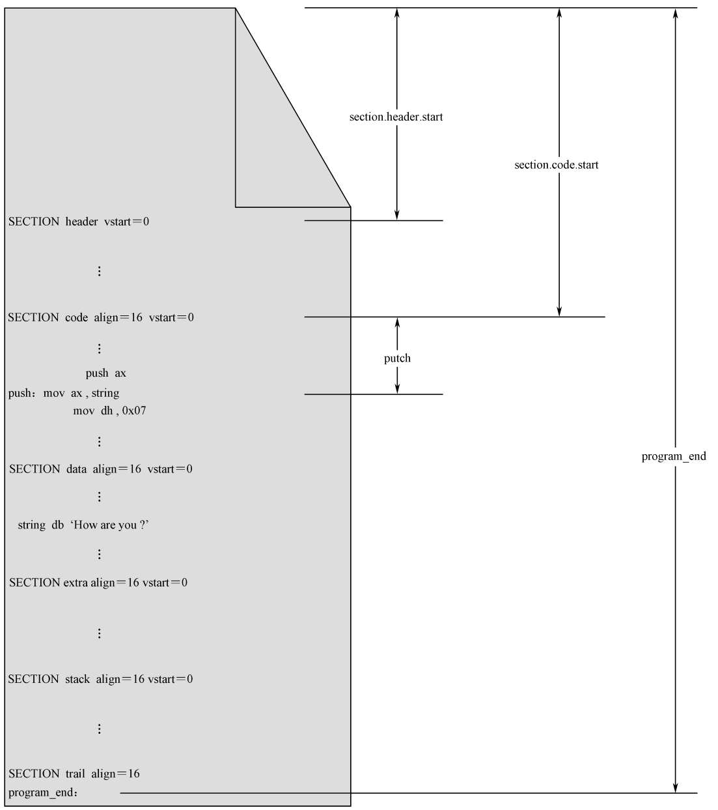
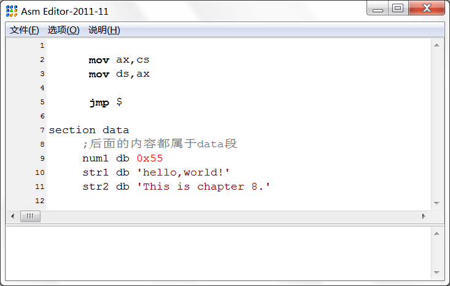
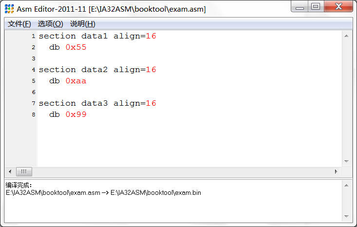

# 硬盘和显卡的访问与控制

## 本章意图

主引导扇区是处理器迈向广阔天地的第一块跳板。离开主引导扇区之后，前方通常就是操作系统的森林，也就是我们经常听说的 DOS、Windows、Linux、UNIX 等。

和主引导扇区程序一样，操作系统也位于硬盘上。操作系统是需要安装到硬盘上的，这个安装过程不但要把操作系统的指令和数据写入硬盘，通常还要更新主引导扇区的内容，好让这块跳板直接连着操作系统。

操作系统通常肩负着处理器管理、内存分配、程序加载、进程（即已经位于内存中的程序）调度、外围设备（显卡、硬盘、声卡等）的控制和管理等任务。

凭个人之力，写一个非常完善的操作系统，这几乎是不可能的事。但是，写个小程序，模拟一下它的某个功能，还是可以的。我们知道，编译好的程序通常都存放在像硬盘这样的载体上，需要加载到内存之后才能执行。这个过程并不简单，首先要读取硬盘，然后决定把它加载到内存的什么位置。最重要的是，程序通常是分段的，载入内存之后，还要重新计算段地址，这叫做段的重定位。

程序可以有千千万万个，但加载过程却是固定的。

在本章，我们把主引导扇区改造成一个程序加载器，或者说是一个加载程序，它的功能是加载用户程序，并执行该程序（将处理器的控制权交给该程序）。

说到这里，我相信你一定很好奇，早就想知道 BIOS 是怎么把主引导扇区读到内存中的，又是怎么让它从 0x0000:0x7c00 处开始执行的。好吧，本章就可以满足你的好奇心。同时我相信，通过在本章里做这件事，可以加深你对处理器、操作系统，以及软件开发过程（包含用高级语言进行软件编写）的理解。

## 用户程序的结构

### 分段、段的汇编地址和段内汇编地址

处理器的工作模式是将内存分成逻辑上的段，指令的获取和数据的访问一律按“段地址：偏移地址”的方式进行。相对应地，一个规范的程序，应当包括代码段、数据段、附加段和堆栈段。这样一来，段的划分和段与段之间的界限在程序加载到内存之前就已经准备好了。

NASM 编译器使用汇编指令“SECTION”或者“SEGMENT”来定义段。它的一般格式是：
```asm
SECTION 段名称
; 或
SEGMENT 段名称
```
每个段都要求给出名字，这就是段名称，它主要用来引用一个段，可以是任意名字，只要它们彼此之间不会重复和混淆。

NASM 编译器不关心段的用途，可能也根本不知道段的用途，不知道它是数据段，还是代码段，或是堆栈段。事实上，这都不重要，段只用来分隔程序中的不同内容。

不过，话又说回来了，作为程序员，每个段的用途，你自己是清楚的。所以，为每个段起一个直观好记的名字，那是应该的。

**第一个段的名字是“header”**，表明它是整个程序的开头部分；

**第二个段的名字是“code”**，表明这是代码段

**第三个段的名字是“data”**，表明这是数据段

<div align=center></div>
<center>用户程序的一般结构</center>

比较重要的是，一旦定义段，那么，后面的内容就都属于该段，除非又出现了另一个段的定义。

另外，有时候，程序并不以段定义语句开始。在这种情况下，这些内容默认地自成一个段。最为典型的情况是，整个程序中都没有段定义语句。这时，整个程序自成一个段。
<div align=center></div>
<center>程序并非以段定义开始的情况</center>

NASM 对段的数量没有限制。一些大的程序，可能拥有不止一个代码段和数据段。

Intel 处理器要求段在内存中的起始物理地址起码是 16 字节对齐的。这句话的意思是，必须是16 的倍数，或者说该物理地址必须能被 16 整除。

相应地，汇编语言源程序中定义的各个段，也有对齐方面的要求。具体做法是，在段定义中使用“align=”子句，用于指定某个 SECTION 的汇编地址对齐方式。比如说，“align=16”就表示段是 16 字节对齐的，“align=32”就表示段是 32 字节对齐的。

在源程序编译阶段，编译器将根据 align 子句确定段的起始汇编地址。如图 8-3 所示，这里定义了三个段，分别是 data1、data2 和 data3，每个段里只有一个字节的数据，分别是 0x55、0xaa 和 0x99。

<div align=center></div>
<center>align 子句对段的影响（编译之前的源代码）</center>

理论上，如果不考虑段的对齐方式，那么段 data1 的汇编地址是 0，段 data2 的汇编地址是 1，段 data3 的汇编地址是 2。

但是，在这里，每个段的定义中都包含了要求 16 字节对齐的子句，情况便不同了（编译后可看）。因为在段 data1 之前没有任何内容，故段 data1 的起始汇编地址是 0。而且地址 0 本身就是 16 字节对齐的，符合 align 子句的要求。段的汇编地址其实就是段内第一个元素（数据、指令）的汇编地址。因此，在段 data1 中声明和初始化的 0x55 位于汇编地址 0x00000000 处。

段 data2 也要求是 16 字节对齐的。问题是，从汇编地址 0x00000001 开始，只有 0x00000010（十进制的 16）才能被 16 整除。于是，编译器将 0x00000010 作为段 data2 的汇编地址，并在两个段之间填充 15 字节的 0x00（段 data1 只有 1 字节的长度）。

段 data3 的处理与前面两个段相同。因为段 data2 只有 1 字节，故也需要在它们之间填充 15 字节。这样，段 data3 的汇编地址就是 0x00000020（十进制的 32）。段 data3 也只有 1 字节（0x99），所以，汇编地址 0x00000020 处是 0x99，这也是编译结果中的最后一字节。

正如我们刚刚讨论过的，每个段都有一个汇编地址，它是相对于整个程序开头（0）的。为了方便取得该段的汇编地址，NASM 编译器提供了以下的表达式，可以用在你的程序中：
```asm
section.段名称.start
```
段“header”相对于整个程序开头的汇编地址是 section.header.start

段定义语句还可以包含“vstart=”子句。尽管定义了段，但是，引用某个标号时，该标号处的汇编地址依然是从整个程序的开头计算的，而不是从段的开头处计算的。这就很麻烦（有时候也很有用）
。因此，vstart 可以解决这个问题。原则上，该标号代表的汇编地址应该从程序开头计算。但是，因为段 code的定义中有“vstart=0”子句，所以，标号“putch”的汇编地址要从它所在段的开头计算，而且从 0开始计算。

但是，图中最后一个段 trail 的定义中没有包含“vstart=0”子句。那就对不起了，该段内有一个标号“program_end”，它的汇编地址就要从整个程序开头计算。

### 用户程序头部

在上面，我们已经知道如何在用户程序中分段，也知道各种段定义子句对段的起始汇编地址和段内汇编地址的影响。现在，让我们结合本章中的实例来进一步加深认识。
