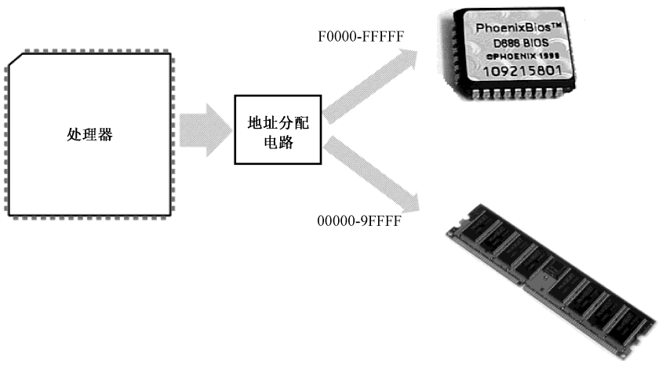
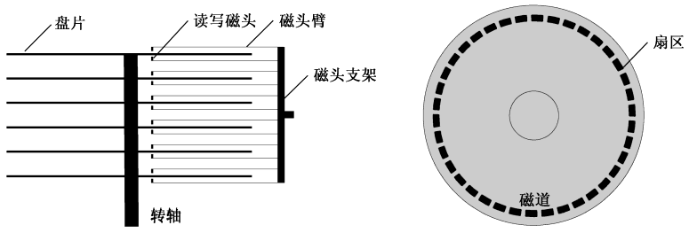
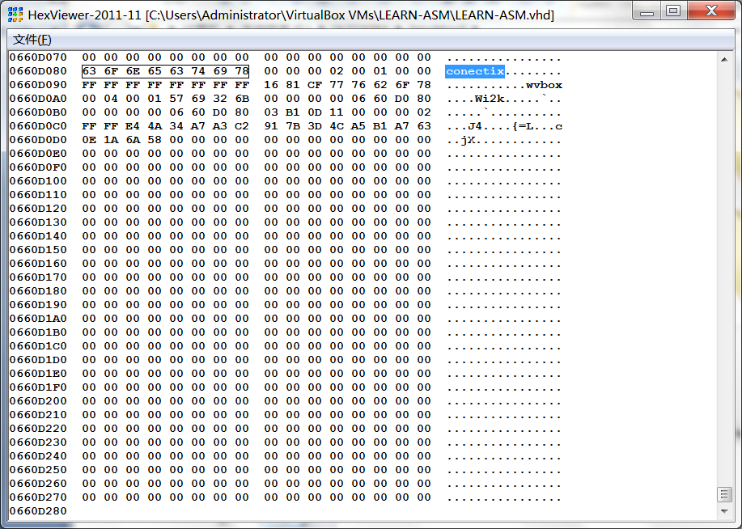

# 虚拟机的安装和使用

## 如何将编译好的程序提交给处理器

对于绝大多数编译好的程序来说，要想得到处理器的光顾，让它执行一下，必须借助于操作系统。每种操作系统都对它所管理的程序提出了种种格式上的要求。

每种编译器都有能力针对不同的操作系统来生成不同格式的二进制文件，程序员所要做的，就是在源程序中加入一些相关的信息，比如指定每个段的开始和结束，并在编译时指定适当的参数。

## 计算机的加点和复位

在处理器众多的引脚中，有一个是 RESET，用于接受复位信号。每当处理器加电，或者 RESET 引脚的电平由低变高时 ，处理器都会执行一个硬件初始化，以及一个可选的内部自测试（Build-in Self-Test，BIST），然后将内部所有寄存器的内容初始到一个预置的状态。

比如，对于 Intel 8086 来说，复位将使代码段寄存器（CS）的内容为 0xFFFF，其他所有寄存器的内容都为 0x0000，包括指令指针寄存器（IP）。8086 之后的处理器并未延续这种设计，但毫无疑问，无论怎么设计，都是有目的的。

处理器的主要功能是取指令和执行指令，加电或者复位之后，它就会立刻尝试去做这样的工作。不过，在这个时候，内存中还没有任何有意义的指令和数据，它该怎么办呢？

为了节约成本，并提高容量和集成度，在内存中，每个比特的存储都是靠一个极其微小的晶体管，外加一个同样极其微小的电容来完成的。可以想象，这样微小的电容，其泄漏电荷的速度当然也非常快。所以，个人计算机中使用的内存需要定期补充电荷，这称为**刷新**，所以这种存储器也称为**动态随机访问存储器（Dynamic Random Access Memory，DRAM）**。

> 随机访问的意思是，访问任何一个内存单元的速度和它的位置（地址）无关。

*在内存刷新期间，处理器将无法访问它*。这还不是最麻烦的，最麻烦的是，在它*断电之后，所有保存的内容都会统统消失*。所以，每当处理器加电之后，它无法从内存中取得任何指令。

### 基本输入输出系统

Intel 8086 可以访问 1MB 的内存空间，地址范围为 0x00000 到 0xFFFFF。出于各方面的考虑，计算机系统的设计者将这 1MB 的内存空间从物理上分为几个部分。

8086 有 20 根地址线，但并非全都用来访问 DRAM，也就是内存条。事实上，这些地址线经过分配，大部分用于访问 DRAM，剩余的部分给了只读存储器 ROM 和外围的板卡，如图所示。

<div align=center></div>
<center>8086 系统的内存空间分配</center>

与 DRAM 不同，只读存储器（Read Only Memory，ROM）不需要刷新，它的内容是预先写入的，即使掉电也不会消失，但也很难改变。这个特点很有用，比如，可以将一些程序指令固化在 ROM 中，使处理器在每次加电时都自动执行。处理器醒来后不能饿着，这是很重要的。

在以 Intel 8086 为处理器的系统中，ROM 占据着整个内存空间顶端的 64KB，物理地址范围是 0xF0000～0xFFFFF，里面固化了开机时要执行的指令

DRAM 占据着较低端的 640KB，地址范围是 0x00000～0x9FFFF；中间还有一部分，分给了其他外围设备，这个以后再说。

因为 8086 加电或者复位时，CS=0xFFFF，IP=0x0000，所以，它取的第一条指令位于物理地址0xFFFF0，正好位于 ROM 中，那里固化了开机时需要执行的指令。

处理器取指令执行的自然顺序是从内存的低地址往高低地址推进。如果从 0xFFFF0 开始执行，这个位置离 1MB 内存的顶端（物理地址 0xFFFFF）只有 16 个字节的长度，一旦 IP 寄存器的值超过 0x000F，比如 IP=0x0011，那么，它与 CS 一起形成的物理地址将因为溢出而变成 0x00001，这将回绕到 1MB 内存的最低端。

所以，ROM 中位于物理地址 0xFFFF0 的地方，通常是一个跳转指令，它通过改变 CS 和 IP 的内容，使处理器从 ROM 中的较低地址处开始取指令执行。在 NASM 汇编语言里，一个典型的跳转指令像这样：
```asm
jmp 0xf000:0xe05b
```
在这里，“jmp”是跳转（jump）的简化形式；0xf000 是要跳转到的段地址，用来改变 CS寄存器的内容；0xe05b 是目标代码段内的偏移地址，用来改变 IP 寄存器的内容。一旦执行这条指令，处理器将开始从指定的“段: 偏移”处开始重新取指令执行。

这块 ROM 芯片中的内容包括很多部分，主要是进行硬件的诊断、检测和初始化。所谓初始化，就是让硬件处于一个正常的、默认的工作状态。最后，它还负责提供一套软件例程，让人们在不必了解硬件细节的情况下从外围设备（比如键盘）获取输入数据，或者向外围设备（比如显示器）输出数据。设备当然是很多的，所以这块 ROM 芯片只针对那些最基本的、对于使用计算机而言最重要的设备，而它所提供的软件例程，也只包含最基本、最常规的功能。正因为如此，这块芯片又叫基本输入输出系统（Base Input & Output System，BIOS）ROM。

ROM-BIOS 的容量是有限的，当它完成自己的使命后，最后所要做的，就是从辅助存储设备读取指令数据，然后转到那里开始执行。基本上，这相当于接力赛中的交接棒。

### 硬盘机及其工作原理

历史上，有多种辅助存储设备，比如软盘、光盘、硬盘、U 盘等，相对于内存，它们就是人们常说的“外存”，即外存储器（设备）。从软盘（Floppy Disk）启动计算机，这已经是过去的事了。软盘的尺寸比烟盒稍大一点，但是比较薄，采用塑料作为基片，上面是一层磁性物质，可以用来记录二进制位。这种塑料介质比较柔软，所以称为软盘。

硬盘是多盘片、密封、高转速的，采用铝合金作为基片，并在表面涂上磁性物质来记录二进制位。这就使得它的盘片具有较高的硬度，故称为硬盘。

<div align=center></div>
<center>硬盘的结构示意图</center>

每个磁头不是单独移动的。相反，它们都通过磁头臂固定在同一个支架上，由步进电动机带动着一起在盘片的中心和边缘之间来回移动。也就是说，它们是同进退的。步进电动机由脉冲驱动，每次可以旋转一个固定的角度，即可以步进一次。

可以想象，当盘片高速旋转时，磁头每步进一次，都会从它所在的位置开始，绕着圆心“画”出一个看不见的圆圈，这就是磁道（Track）。磁道是数据记录的轨迹。因为所有磁头都是联动的，故每个盘面上的同一条磁道又可以形成一个虚拟的圆柱，称为柱面（Cylinder）。

磁道，或者柱面，也要编号。编号是从盘面最边缘的那条磁道开始，向着圆心的方向，从 0 开始编号。

柱面是一个用来优化数据读写的概念。初看起来，用硬盘来记录数据时，应该先将一个盘面填满后，再填写另一个盘面。实际上，移动磁头是一个机械动作，看似很快，但对处理器来说，却很漫长，这就是寻道时间。为了加速数据在硬盘上的读写，最好的办法就是尽量不移动磁头。这样，当 0 面的磁道不足以容纳要写入的数据时，应当把剩余的部分写在 1 面的同一磁道上。如果还写不下，那就继续把剩余的部分写在 2 面的同一磁道上。换句话说，在硬盘上，数据的访问是以柱面来组织的。

实际上，磁道还不是硬盘数据读写的最小单位，磁道还要进一步划分为扇区（Sector）。磁道很窄，也看不见，但在想象中，它仍呈带状，占有一定的宽度。将它划分许多分段之后，每一部分都呈扇形，这就是扇区的由来。

每条磁道能够划分为几个扇区，取决于磁盘的制造者，但通常为 63 个。而且，每个扇区都有一个编号，与磁头和磁道不同，扇区的编号是从 1 开始的。扇区与扇区之间以间隙（空白）间隔开来，每个扇区以扇区头开始，然后是 512 个字节的数据区。扇区头包含了每个扇区自己的信息，主要有本扇区的磁道号、磁头号和扇区号，用来供硬盘定位机构使用。现代的硬盘还会在扇区头部包括一个指示扇区是否健康的标志，以及用来替换该扇区的扇区地址。用于替换扇区的，是一些保留和隐藏的磁道。

### 一切从主引导扇区开始

前面说到，当 ROM-BIOS 完成自己的使命之前，最后要做的一件事是从外存储设备读取更多的指令来交给处理器执行。现实的情况是，绝大多数时候，对于 ROM-BIOS 来说，硬盘都是首选的外存储设备。硬盘的第一个扇区是 0 面 0 道 1 扇区，或者说是 0 头 0 柱 1 扇区，这个扇区称为主引导扇区。如果计算机的设置是从硬盘启动，那么，ROM-BIOS 将读取硬盘主引导扇区的内容，将它加载到内存地址 0x0000:0x7c00 处（也就是物理地址 0x07C00），然后用一个 jmp 指令跳到那里接着执行：

```asm
jmp 0x0000:0x7c00
```
为什么偏偏是 0x7c00 这个地方？还不太清楚。反正当初定下这个方案的家伙已经被人说了很多坏话，我也就不准备再多说什么了。

说到这里，我们可以想象，如果我们把自己编译好的程序写到主引导扇区，不也能够让处理器执行吗？

对于这种想法，我有一个好消息和一个坏消息要告诉你。

好消息是，这是可以的，而且这几乎是在不依赖操作系统的情况下，让我们的程序可以执行的唯一方法。

不过，坏消息是，如果你改写了硬盘的主引导扇区，那么，Windows 和 Linux，以及任何你正在使用的操作系统都会瘫痪，无法启动了。

那么，我们该怎么办呢？

答案是在你现有的计算机上，再虚拟出一台计算机来。

## 创建和使用虚拟机

### 下载 VM VirtualBox
### 安装 VM VirtualBox
### 虚拟硬盘简介

坦白地说，之所以要采用固定尺寸的 VHD 虚拟硬盘，是因为其简单性。我们知道，虚拟硬盘实际上是一个文件。固定尺寸的 VHD 虚拟硬盘是一个具有“.vhd”扩展名的文件，它仅包括两个部分，前面是数据区，用来模拟实际的硬盘空间，后面跟着一个 512 字节的结尾（2004 年前的规范里只有 511 字节）。

要访问硬盘，运行中的程序必须至少向硬盘控制器提供 `4` 个参数，分别是**磁头号**、**磁道号**、**扇区号**，以及**访问意图（是读还是写）**。

硬盘的读写是以扇区为最小单位的。所以，无论什么时候，要从硬盘读数据，或者向硬盘写数据，至少得是 1 个扇区。你可能想，我只有 2 字节的数据，不足以填满一个扇区，怎么办呢？你可以用无意义的废数字来填充，凑够一个扇区的长度，然后写入。读取的时候也是这样，你需要自己跟踪和把握从扇区里读到的数据，哪些是你真正想要的。

在 VHD 规范里，每个扇区是 512 字节。VHD 文件一开始的 512 字节，就对应着物理硬盘的 0 面 0 道 1 扇区。然后，VHD 文件的第二个 512 字节，对应着 0 面 0 道 2 扇区，后面的依次类推，一直对应到 0 面 0 道 n 扇区。这里，n 等于每磁道的扇区数。

再往后，因为硬盘的访问是按柱面进行的，所以，在 VHD 文件中，紧接着前面的数据块，下一个数据块对应的是 1 面 0 道 1 扇区，就这样一直往后排列，当把第一个柱面全部对应完后，再从第二个柱面开始对应。

如图所示，为了标志一个文件是 VHD 格式的虚拟硬盘，并为使用它的虚拟机提供该硬盘的参数，在 VHD 文件的结尾，包含了 512 字节的格式信息。为了观察这些信息，我们使用了前面已经介绍过的配书工具 HexView。

如图所示，文件尾信息是以一个字符串“conectix”开始的。这个标志用来告诉试图打开它的虚拟机，这的确是一个合法的 VHD 文件。该标志称为 VHD 创建者标识，就是说，该公（conectix）创建了 VHD 文件格式的最初标准。

<div align=center></div>
<center>VHD 文件的格式信息</center>

从这个标志开始，后面的数据包含了诸如文件的创建日期、VHD 的版本、创建该文件的应用程序名称和版本、创建该文件的应用程序所属的操作系统、该虚拟硬盘的参数（磁头数、每面磁道数、每磁道扇区数）、VHD 类型（固定尺寸还是动态增长）、虚拟硬盘容量等。

说到这里，也许你已经明白我为什么要在书中使用固定尺寸的 VHD。是的，因为它简单。为了学习汇编语言，我们不得不在硬盘上直接写入程序。因为 VHD 格式简单，所以我只花了很少的时间就开发了一个虚拟硬盘写入程序，作为配书工具让大家使用，这就是下一节将要介绍的FixVhdWr。至于为什么要使用 VirtualBox 虚拟机，是因为它支持 VHD，而且是免费的。先前版本的VirtualBox 可以识别 VHD，但不支持创建新的 VHD，尽管微软公司很早就公开了 VHD 规范。好消息是现在的 VirtualBox 也可以创建 VHD 了。

### 联系使用 FixVhdWr 工具像虚拟硬盘写数据

[C++读写固定大小的VHD文件](https://visualgmq.gitee.io/2019/12/11/%E7%94%A8C++%E8%AF%BB%E5%8F%96%E5%9B%BA%E5%AE%9AVHD%E6%96%87%E4%BB%B6/)

也可使用 dd 命令读取和写入

```shell
# 将main.bin文件写入到test.vhd文件的第一个扇区中
dd -if=main.bin -of=main.bin bs=512 count=1 conv=notrunc
```

- if指令代表要写入的文件
- of指令代表要写入的文件
- bs代表依次写入多少字节，这里是一个扇区512字节
- count代表写入多少个bs，这里是一个
- 最后的conv=notrunc代表不截断文件。如果你的VHD文件是虚拟VHD，那么根据其文件格式，文件尾会附加VHD的信息。使用notrunc可以不覆盖这个信息。

通常，一个扇区的尺寸是 512 字节，可以看成一个数据块。所以，从这个意义上来说，硬盘是一个典型的块（Block）设备。

采用磁头、磁道和扇区这种模式来访问硬盘的方法称为 CHS 模式，但不是很方便。想想看，如果有一大堆数据要写，还得注意磁头号、磁道号和扇区号不要超过界限。所以，后来引入了逻辑块地址（Logical Block Address，LBA）的概念。现在市场上销售的硬盘，无论是哪个厂家生产的，都支持 LBA 模式。

LBA 模式是由硬盘控制器在硬件一级上提供支持，所以效率很高，兼容性很好。LBA 模式不考虑扇区的物理位置（磁头号、磁道号），而是把它们全部组织起来统一编号。在这种编址方式下，原先的物理扇区被组织成逻辑扇区，且都有唯一的逻辑扇区号，比如，某硬盘有 6 个磁头，每面有 1000 个磁道，每磁道有 17 个扇区。那么：
```
逻辑 0 扇区对应着 0 面 0 道 1 扇区；
逻辑 1 扇区对应着 0 面 0 道 2 扇区；
……
逻辑 16 扇区对应着 0 面 0 道 17 扇区；
逻辑 17 扇区对应着 1 面 0 道 1 扇区；
逻辑 18 扇区对应着 1 面 0 道 2 扇区；
……
逻辑 33 扇区对应着 1 面 0 道 17 扇区；
逻辑 34 扇区对应着 2 面 0 道 1 扇区；
逻辑 35 扇区对应着 2 面 0 道 2 扇区；
……
逻辑 101999 扇区对应着 5 面 999 道 17 扇区，这也是整个硬盘上最后一个物理扇区。
```

这里面的计算方法是：
```
LBA = C×磁头总数×每道扇区数＋H×每道扇区数＋(S－1)
```
这里，LBA 是逻辑扇区号，C、H、S 是想求得逻辑扇区号的那个物理扇区所在的磁道、磁头和扇区号。

采用 LBA 模式的好处是简化了程序的操作，使得程序员不用关心数据在硬盘上的具体位置。对于本书来说，VHD 文件是按 LBA 方式组织的，一开始的 512 字节就是逻辑 0 扇区，然后是逻辑 1 扇区；最后一个逻辑扇区排在文件的最后（最后 512 个字节除外，那是 VHD 文件的标识部分）。