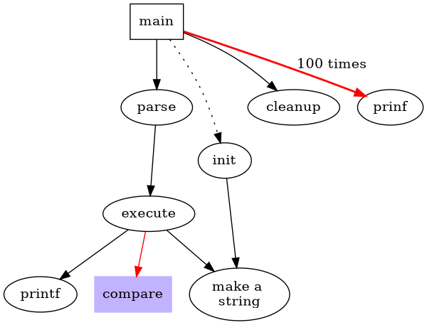

# dot

dot 接受 DOT 语言的输入。

此语言描述了三种主要对象类型：图形(graphs)、节点(nodes)和边(edges)。

主（最外层）图形可以是有向图或无方向图形

## 例子1

- 第 1 行提供图形名称和类型
- 后续的行创建节点、边或子图，并设置属性。所有这些对象的名称可以是 C 标识符、数字或引用的 C 字符串。引号保护标点符号和空白
- 当节点的名称首次出现在文件中时，将创建节点
- 当边运算符 -> 加入节点时，将创建边

