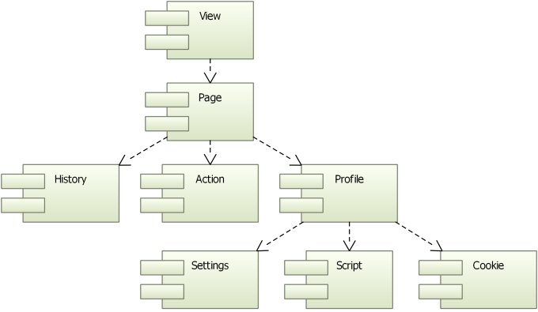
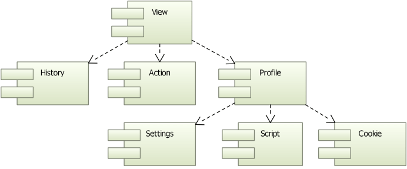

# QWebEngine

Qt WebEngine 提供了动态渲染网页内容的机制。

## Qt WebEngine 概述

```
Qt WebEngine Widgets         Qt WebEngine            Qt WebEngine Process
        |                       |                           |
       \|/                     \|/                         \|/
--------------------------------------------------------------------------
Qt WebEngine Core
--------------------------------------------------------------------------
Chromium
```
Qt WebEngine 中的功能分为以下模块
- 用于创建基于QWidget程序的模块
- _用于创建基于Qt Quick程序的模块(此处不考虑这块内容)_
- 用于与Chromium交互的核心模块

### Qt WebEngine Widgets模块



`Qt WebEngine View` 是 Qt WebEngine 模块的主要小部件。它用于加载网络内容（比如：网页）。在`view`中，web engine页面包含一个主框架，该主框架负责web内容、导航连接的历史记录和操作。`view`和`page`非常相似，因为它们提供了一组共同的功能。

所有`page`都属于`profile`，其中包含了`settings`、`cookies`。

> 注意：Qt WebEngine Widgets模块使用了 Qt Quick graph场景将网页元素组成一个`view`

内容是通过 GPU 渲染的。

### Qt WebEngine 模块



Qt WebEngine QML 实现包含与 Qt WebEngine Widgets 实现相同的元素，除了没有单独可访问的web engine widgets，支持的页面功能被集成到web engine view 中。

## Qt WebEngine 核心C++类

> 这些类是 QtWebEngine 和 QtWebEngineWidgets 共享的API调用

Qt WebEngine Core基于 Chromium 项目。Chromium提供自己的网络和渲染引擎。

Qt WebEngine Process 是一个单独的可执行文件，用于渲染网页和执行javascript。

## Qt WebEngine Widgets C++类

> 这些类用于在基于QWidget的应用程序中渲染Web内容

## Qt WebChannel Javascript API

Qt WebChannel 支持服务器（QML/C++应用程序）和客户端（HTML/JavaScript或QML应用程序）之间的点对点通信。

该模块提供了一个JavaScript库，用于将C++和QML应用程序与HTML/JavaScript和QML客户端无缝集成。客户端必须使用JavaScript库来访问主机应用程序发布的序列化对象。

要与 QWebChannel 通信，客户端必须使用并设置 qwechannel.js 提供的 Javascript API。对于在 QtWebEngine中运行的客户端，你可以加载 `qrc://xxx/qtwebchannel.js` 文件。

对于外部客户端，你需要把此文件复制到网络服务器，然后实例化 QWebChannel 对象，并传递一个传输对象和回调函数，一旦通道的初始化完成并且已发布的对象可用，将调用该函数。

传输对象实现了最小消息传递接口，它应该是一个具有`send()`函数的对象，该函数接收json消息，传递到服务器的 QWebChannelAbstractTransport对象。此外，当收到来自服务器的消息时候，应调用其onMessage属性，或者你可以使用websocket来实现接口。

> 请注意：一旦传输对象完全运行，就应构建JavaScriptChannel对象，在WebSocket的情况下，这意味着您应该在套接字的 onOpen 处程序中创建完成。

### 开始使用

1. 头文件

```c++
#include <QtWebChannel/QtWebChannel>
```

2. 项目中
```
QT += webchannel
```

3. 代码中

// QWebEngineView 中
// 以便 javascript 调用C++
```c++
QWebChannel* channel = new QWebChannel(this);
channel->registerObject("iand", this->core);  // 向QWebChannel注册用于Qt和Web交互的对象。
this->page()->setWebChannel(channel);
```

4. c++ 调用javascript
```c++
view->page()->runJavaScript("showPie(%1)".arg(sss));
```

5. javascript 调用C++函数

```js
// 和QT交互
new QWebChannel(qt.webchannelTransport, function(channel) {
    window.bridge = channel.objects.bridge_name;
})

// 调用C++中的函数
if (bridge) {
    bridge.showMsgBox(params.name);
}
```

C++中对应代码
```c++
class bridge : public QObject
{
    Q_OBJECT
public:

public slots:
    void showMsgBox(QString msg); // 申请槽函数，供js中使用
};
```

C++中对应代码

```c++
{
    view = new QWebEngineView(this);
    setCentraWidget(view);

    channel = new QWebChannel(this);
    bridge1 = new bridge;
    channel->registerObject("mybridge", (QObject*) bridge1);
    
    view->page()->setWebChannel(channel);

    view->page()->load("https://xxxx");
}
```

### 与QObject交互

一旦调用传递给 QWebChannel 对象的回调，通道就完成了初始化，所有已经发布的对象都可以通过通道访问。

```js
new QWebChannel(yourTransport, function(channel) {

    // Connect to a signal:
    channel.objects.foo.mySignal.connect(function() {
        // This callback will be invoked whenever the signal is emitted on the C++/QML side.
        console.log(arguments);
    });

    // To make the object known globally, assign it to the window object, i.e.:
    window.foo = channel.objects.foo;

    // Invoke a method:
    foo.myMethod(arg1, arg2, function(returnValue) {
        // This callback will be invoked when myMethod has a return value. Keep in mind that
        // the communication is asynchronous, hence the need for this callback.
        console.log(returnValue);
    });

    // Read a property value, which is cached on the client side:
    console.log(foo.myProperty);

    // Writing a property will instantly update the client side cache.
    // The remote end will be notified about the change asynchronously
    foo.myProperty = "Hello World!";

    // To get notified about remote property changes,
    // simply connect to the corresponding notify signal:
    foo.myPropertyChanged.connect(function() {
        console.log(foo.myProperty);
    });

    // One can also access enums that are marked with Q_ENUM:
    console.log(foo.MyEnum.MyEnumerator);
});
```

### 重载的方法和信号

// C++端
```c++
class Foo : public QObject
{
    Q_OBJECT
slots:
    void foo(int i);
    void foo(double d);
    void foo(const QString &str);
    void foo(const QString &str, int i);

signals:
    void bar(int i);
    void bar(const QString &str);
    void bar(const QString &str, int i);
};
```

// javascript 端
```js
// methods
foo.foo(42); // will call the method named foo which best matches the JavaScript number parameter, i.e. foo(double d)
foo.foo("asdf"); // will call foo(const QString &str)
foo.foo("asdf", 42); // will call foo(const QString &str, int i)
foo["foo(int)"](42); // explicitly call foo(int i), *not* foo(double d)
foo["foo(QString)"]("asdf"); // explicitly call foo(const QString &str)
foo["foo(QString,int)"]("asdf", 42); // explicitly call foo(const QString &str, int i)

// signals
foo.bar.connect(...); // connect to first signal named bar, i.e. bar(int i)
foo["bar(int)"].connect(...); // connect explicitly to bar(int i)
foo["bar(QString)"].connect(...); // connect explicitly to bar(const QString &str)
foo["bar(QString,int)"].connect(...); // connect explicitly to bar(const QString &str, int i)
```
